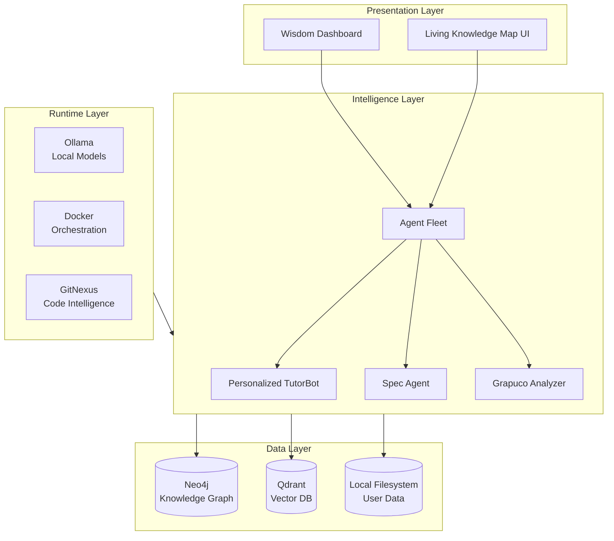
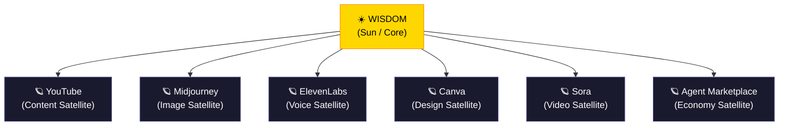
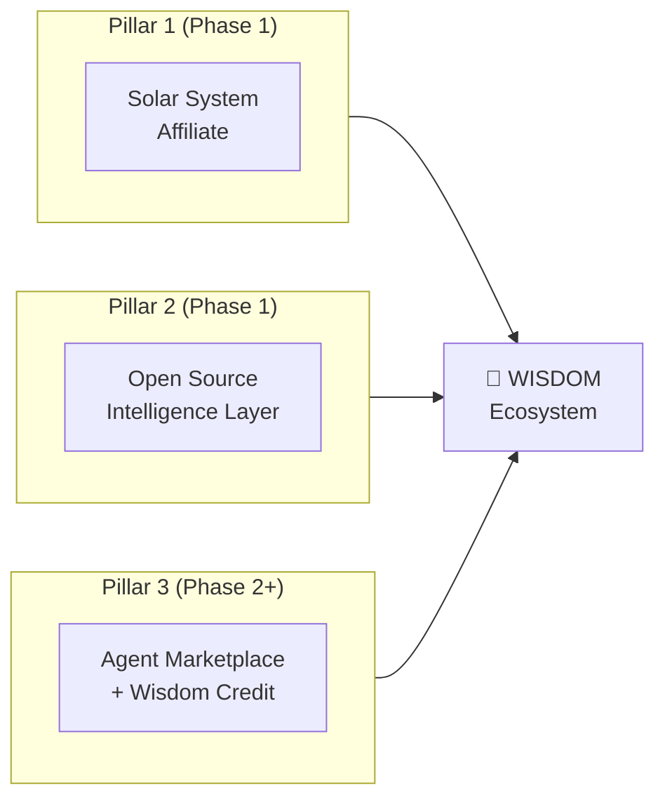
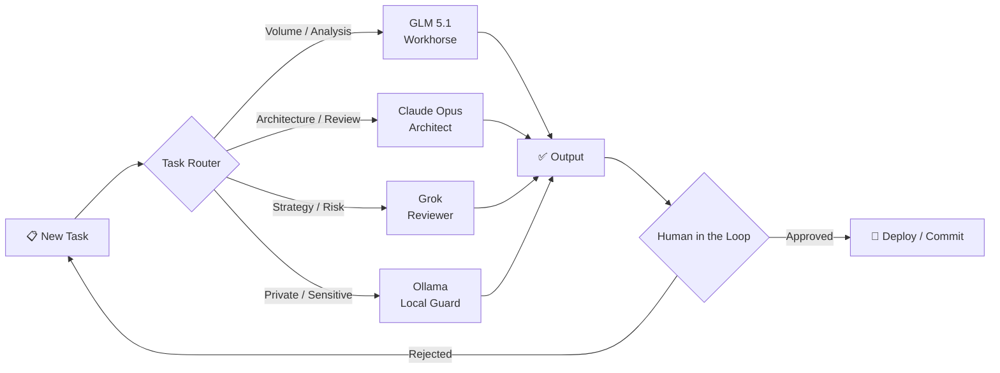
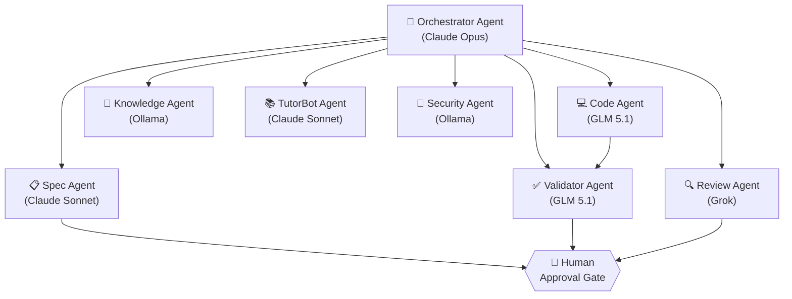
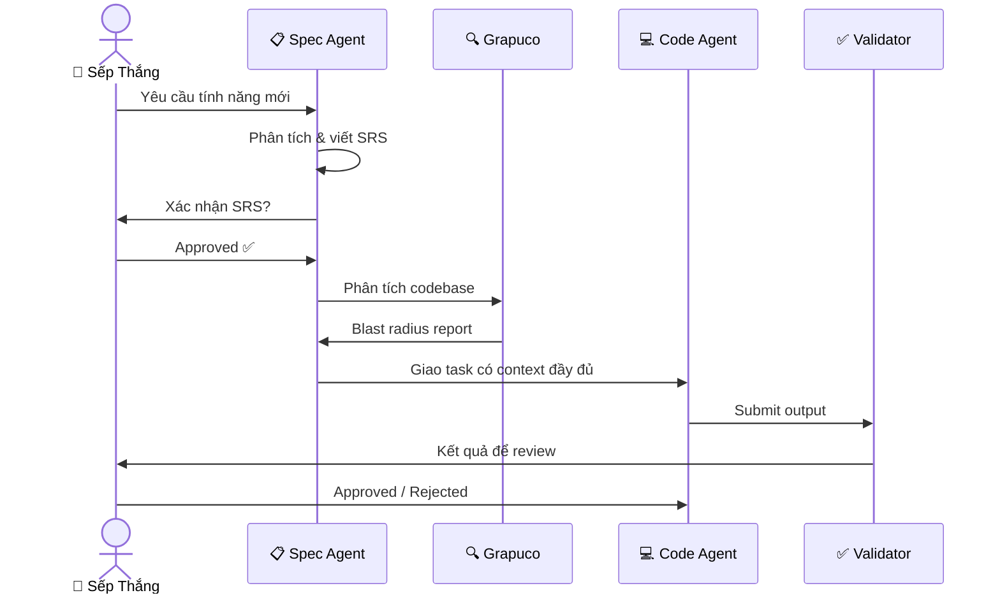
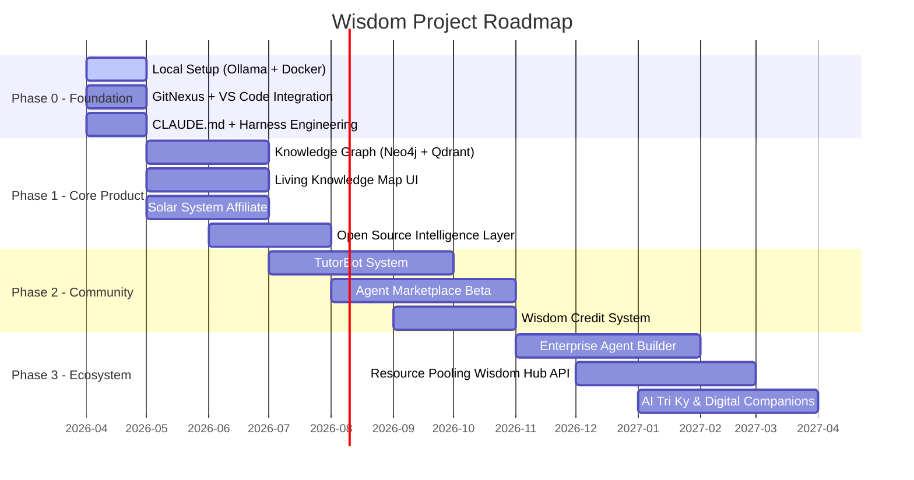

# ARCHITECTURE.md — Wisdom Project
> **Version:** 2026.1 | **Status:** Phase 0 - Local Setup  
> **Maintainer:** Sếp Thắng + Claude Co-Builder + Grok  
> **Last Updated:** 2026-04-30

---

## Mục lục / Table of Contents

1. [Tầm nhìn / Vision](#1-tầm-nhìn--vision)
2. [Kiến trúc cốt lõi / Core Architecture](#2-kiến-trúc-cốt-lõi--core-architecture)
3. [Solar System Architecture](#3-solar-system-architecture)
4. [Multi-Model Strategy](#4-multi-model-strategy)
5. [Agent Fleet](#5-agent-fleet)
6. [Spec Agent + Grapuco](#6-spec-agent--grapuco)
7. [Security & Privacy](#7-security--privacy)
8. [Roadmap Phase 0–3](#8-roadmap-phase-03)

---

## 1. Tầm nhìn / Vision

### 🇻🇳 Tiếng Việt

Wisdom là một **Bản đồ Tri thức sống, tự tiến hóa** — kết hợp Second Brain cá nhân và cộng đồng tri thức Việt Nam.  
Wisdom không chỉ lưu trữ kiến thức mà còn giúp người dùng **hiểu sâu, kết nối ý tưởng, và biến tri thức thành hành động** — cả học tập lẫn kiếm tiền.  
Mục tiêu cuối cùng: Wisdom trở thành **Ecosystem Owner** — nơi người dùng không chỉ dùng tool mà còn **sống và kiếm tiền** trong hệ sinh thái.

### 🇬🇧 English

Wisdom is a **living, self-evolving Knowledge Map** — combining personal Second Brain and Vietnamese knowledge community infrastructure.  
Wisdom doesn't just store knowledge; it helps users **understand deeply, connect ideas, and transform knowledge into action** — both learning and earning.  
The ultimate goal: Wisdom becomes an **Ecosystem Owner** — where users don't just use a tool but **live and earn** within the ecosystem.

---

## 2. Kiến trúc cốt lõi / Core Architecture

### 🇻🇳 Tiếng Việt

Wisdom được xây dựng trên 5 nguyên tắc kiến trúc:

| Nguyên tắc | Mô tả |
|---|---|
| **Local-first + Privacy** | Dữ liệu nằm trên máy người dùng, không phụ thuộc cloud |
| **Human in the Loop** | Người dùng luôn có quyền quyết định cuối cùng |
| **Self-Evolving** | Hệ thống tự học, tự sửa lỗi, tự bổ sung kiến thức |
| **Harness Engineering** | Môi trường vững chắc cho AI agent: session memory, validator, approval gate |
| **SRS-First** | Thiết kế yêu cầu rõ ràng trước khi code |

### 🇬🇧 English

| Principle | Description |
|---|---|
| **Local-first + Privacy** | Data resides on user's machine, cloud-independent |
| **Human in the Loop** | User always holds final decision authority |
| **Self-Evolving** | System self-learns, self-corrects, self-supplements knowledge |
| **Harness Engineering** | Robust AI environment: session memory, validator, approval gate |
| **SRS-First** | Clear requirements design before any code is written |

### Sơ đồ lớp kiến trúc / Architecture Layer Diagram

---

## 3. Solar System Architecture

### 🇻🇳 Tiếng Việt

Wisdom đóng vai **Mặt trời** — trung tâm điều khiển, lưu trữ tri thức và Dashboard chính.  
Các nền tảng bên ngoài (YouTube, Midjourney, Sora, ElevenLabs, Canva…) là **Vệ tinh** xoay quanh.  
Wisdom không cạnh tranh với các vệ tinh — Wisdom **hấp dẫn và điều phối** chúng.

### 🇬🇧 English

Wisdom plays the role of the **Sun** — central controller, knowledge repository, and main Dashboard.  
External platforms are **Satellites** orbiting it. Wisdom doesn't compete — Wisdom **attracts and orchestrates** them.

### Ba Trụ Cột Kiếm Tiền / Three Revenue Pillars

---

## 4. Multi-Model Strategy

### 🇻🇳 Tiếng Việt

| Model | Vai trò | Khi nào dùng |
|---|---|---|
| **GLM 5.1** | Workhorse | Task volume cao, chạy dài, phân tích codebase lớn |
| **Claude Sonnet/Opus** | Architect | Kiến trúc hệ thống, review code, quyết định quan trọng |
| **Grok** | Reviewer | Cross-check logic, đánh giá rủi ro, brainstorm chiến lược |
| **Ollama (Local)** | Privacy Guard | Xử lý dữ liệu nhạy cảm, offline mode |

### 🇬🇧 English

| Model | Role | When to Use |
|---|---|---|
| **GLM 5.1** | Workhorse | High-volume tasks, long-running analysis, large codebase scan |
| **Claude Sonnet/Opus** | Architect | System architecture, code review, critical decisions |
| **Grok** | Reviewer | Cross-check logic, risk assessment, strategy brainstorm |
| **Ollama (Local)** | Privacy Guard | Sensitive data processing, offline mode |

---

## 5. Agent Fleet

### 🇻🇳 Tiếng Việt

| Agent | Vai trò | Model ưu tiên |
|---|---|---|
| **Orchestrator Agent** | Điều phối toàn bộ fleet, phân phối task | Claude Opus |
| **Spec Agent** | Viết SRS, phân tích yêu cầu nghiệp vụ | Claude Sonnet |
| **Code Agent** | Sinh code, refactor, debug | GLM 5.1 |
| **Review Agent** | Review code, kiểm tra blast radius | Grok |
| **Knowledge Agent** | Cập nhật Knowledge Graph, vector indexing | Ollama |
| **TutorBot Agent** | Cá nhân hóa học tập, SRS flashcard | Claude Sonnet |
| **Validator Agent** | Xác minh output, Proof of Value | GLM 5.1 |
| **Security Agent** | Kiểm tra bảo mật, Honey Pot monitoring | Ollama |

### 🇬🇧 English

| Agent | Role | Preferred Model |
|---|---|---|
| **Orchestrator Agent** | Coordinates entire fleet, distributes tasks | Claude Opus |
| **Spec Agent** | Writes SRS, analyzes business requirements | Claude Sonnet |
| **Code Agent** | Generates code, refactors, debugs | GLM 5.1 |
| **Review Agent** | Code review, blast radius check | Grok |
| **Knowledge Agent** | Updates Knowledge Graph, vector indexing | Ollama |
| **TutorBot Agent** | Personalized learning, SRS flashcards | Claude Sonnet |
| **Validator Agent** | Verifies output, Proof of Value | GLM 5.1 |
| **Security Agent** | Security checks, Honey Pot monitoring | Ollama |

---

## 6. Spec Agent + Grapuco

### 🇻🇳 Tiếng Việt

**Spec Agent** chịu trách nhiệm:
- Phân tích yêu cầu nghiệp vụ từ Sếp → sinh ra tài liệu SRS có cấu trúc
- Làm rõ ambiguity trước khi bất kỳ code nào được viết
- Lưu SRS vào Knowledge Graph để truy vết sau này

**Grapuco** (Graph Understanding + Code Analyzer):
- Đọc và hiểu toàn bộ codebase trước khi agent sửa đổi
- Đánh giá **blast radius** — phạm vi ảnh hưởng của mọi thay đổi
- Ngăn chặn side effect không mong muốn trong hệ thống phức tạp

### 🇬🇧 English

**Spec Agent** is responsible for:
- Analyzing business requirements → generating structured SRS documents
- Clarifying ambiguity before any code is written
- Storing SRS into the Knowledge Graph for traceability

**Grapuco** (Graph Understanding + Code Analyzer):
- Reads and understands the entire codebase before agents make changes
- Evaluates **blast radius** — the impact scope of every change
- Prevents unintended side effects in complex systems

---

## 7. Security & Privacy

### 🇻🇳 Tiếng Việt

| Lớp | Cơ chế |
|---|---|
| **Data Layer** | Data Sharding, Local-first storage, Encryption at rest |
| **Economy Layer** | Micro-Wallets, Escrow, Wisdom Credit (100 Credit = 1 USD) |
| **Agent Layer** | Sandbox execution, Budget cap per agent, Approval Gate |
| **Monitoring** | Honey Pots, Anomaly Detection, Security Agent |
| **Emergency** | Master Switch (Freeze Wallet, Tax Adjuster, Kill Switch) |

**Nguyên tắc Privacy:**
- Dữ liệu cá nhân **không bao giờ** rời máy người dùng mà không có sự cho phép tường minh
- Per-User Vectorization: mỗi người dùng có không gian vector riêng, cô lập hoàn toàn
- Ollama local model xử lý mọi dữ liệu nhạy cảm

### 🇬🇧 English

| Layer | Mechanism |
|---|---|
| **Data Layer** | Data Sharding, Local-first storage, Encryption at rest |
| **Economy Layer** | Micro-Wallets, Escrow, Wisdom Credit (100 Credit = 1 USD) |
| **Agent Layer** | Sandbox execution, Budget cap per agent, Approval Gate |
| **Monitoring** | Honey Pots, Anomaly Detection, Security Agent |
| **Emergency** | Master Switch (Freeze Wallet, Tax Adjuster, Kill Switch) |

**Privacy Principles:**
- Personal data **never** leaves the user's machine without explicit permission
- Per-User Vectorization: each user has a fully isolated vector space
- Ollama local model processes all sensitive data

---

## 8. Roadmap Phase 0–3

### Phase 0 — Foundation (Hiện tại / Current)

| Task | Stack | Status |
|---|---|---|
| Cài đặt Ollama + local models | Ollama | 🔄 In Progress |
| Docker Compose environment | Docker | 🔄 In Progress |
| VS Code + Claude Code / Antigravity | VS Code | 🔄 In Progress |
| GitNexus code intelligence | GitNexus | 📋 Planned |
| CLAUDE.md Harness Engineering | Markdown | 🔄 In Progress |

### Phase 1 — Core Product
- Knowledge Graph (Neo4j) + Vector Database (Qdrant)
- Living Knowledge Map với visualization colorful
- Solar System Affiliate — Recommended Stack
- Open Source Intelligence Layer cho user non-tech

### Phase 2 — Community & Economy
- Personalized TutorBot System
- Agent Marketplace (Beta) — niêm yết và cho thuê Skill/Agent
- Wisdom Credit System (100 Credit = 1 USD), phí sàn 18%

### Phase 3 — Full Ecosystem
- Enterprise Agent Builder (local + cloud burst)
- Resource Pooling — Wisdom Hub API
- AI Tri Kỷ & Digital Companions
- Amazon Flywheel: càng nhiều user → càng nhiều data → AI càng tốt → càng nhiều user

---

## Ghi chú / Notes

- File này là **tài liệu sống** — cập nhật sau mỗi milestone quan trọng.
- Mọi thay đổi kiến trúc lớn phải có **Human Approval** từ Sếp Thắng.
- Khi có bài học mới, cập nhật đồng thời `ARCHITECTURE.md` và `CLAUDE.md`.

---

*Generated by Claude Co-Builder | Wisdom Project v2026*